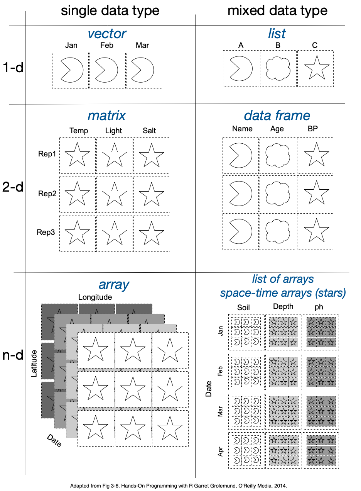

> 
>
> “It is a capital mistake to theorize before one has data.”
>
> :   Sherlock Holmes in “A study in Scarlet” by Arthur Conan Doyle

Data frames are 2 dimensional collections of data that share a look and feel with spreadsheets, but they have many more uses with fewer drawbacks. Spreadsheets have their uses, but data frames give the user more power to manipulate and analyze data.

## A review of R's basic data structures

R has a variety of [data types called `atomic`](https://cran.r-project.org/doc/manuals/r-release/R-lang.html#Vectors); we are most familiar with `numeric`, `logical` and `character`. There are some others we might consider as `atomic` such as `Date` and `POSIXt` even though in reality each are special types of `numeric`.

These can be organized into containers such as vectors, matrices, arrays, lists and, our friend today, data.frames. The diagram below shows the approximate relationship among the different types of containers.



[The base R data frame](https://cran.r-project.org/doc/manuals/r-release/R-intro.html#Data-frames) is called `data.frame, but really it is a [special list](https://cran.r-project.org/doc/manuals/r-release/R-intro.html#Lists), which, in turn, is a [special vector](https://cran.r-project.org/doc/manuals/r-release/R-intro.html#Simple-manipulations-numbers-and-vectors)`.

### The players or "a data frame is a list is a vector"

A **vector** is a collection of atomic data types (numeric, integer, character, logical, Date, POSIXt, etc.) Elements *may* be named.

A **list** is a special vector that removes the atomic data type membership requirement. Instead, each element can by any data type. Elements *may* be named..

A **data frame** is a special type of list where elements **must be named**, and the each element *must have the same length* as that of its sibling elements.

A **matrix** is a 2-d grid of uniform lcass objects organized by rows and columns.  We often think of them terms of numeric atomic data types, but can contain any type.

## Data

We'll use the `flights` data frame from [Hadley Wickham](https://cran.r-project.org/web/packages/nycflights13/index.html).  Below, we check that you have the packages we'll use, and, if not, we install them for you.  We also provide a small function to retrieve the `flights` data as one of `data.frame`, `tibble`, `data.table` or `tidytable`.

```{r}
packages = c("dplyr", "data.table","tidytable", "nycflights13", "sf")
installed = installed.packages()
for (package in packages){
  if (!package %in% rownames(installed)){
    install.packages(package)
  }
  suppressPackageStartupMessages({
    library(package, character.only = TRUE)
  })
}

#' Read in the `flights` data as a user-specified type
#' of data frame
#' 
#' @param type chr, the type of table to return
#' @return a data frame of the specified type
read_flights = function(type = c("data.frame",
                                 "tibble",
                                 "data.table",
                                 "tidytable")[1]){
  switch(tolower(type[1]),
         "data.frame" = as.data.frame(flights),
         "tibble" = dplyr::as_tibble(flights),
         "data.table" = data.table::as.data.table(flights),
         "tidytable" = tidytable::as_tidytable(flights))
}
```

The following code chunk is available as a [gist on github](https://gist.github.com/btupper/463c55f6110b095c76bc4530cdf855cf).  So you could simply run this in R: `source("https://gist.githubusercontent.com/btupper/463c55f6110b095c76bc4530cdf855cf/raw/28d1e2e160b2ebcf798dfde569e0a5de967b745f/data_frames.R")`.

## A review on `data.frame` class objects

Before we dig into the universe of data frame paradigms, let's quickly review some properties of [base R `data.frames`](https://www.rdocumentation.org/packages/base/versions/3.0.3/topics/data.frame).

### Creating `data.frame` objects

The `data.frame` is the foundational structure for all data frames. They can be created from scratch...

```{r}
df = data.frame(
  a = c(1,4,9),
  b = c("dog", "cat", "fish"))
df
```

Or you can coerce (some) lists into data frames.

```{r}
lst = list(name = c("oak", "cherry", "pine", "birch", "ash"),
           difficulty = c("hard", "gnarly", "easy", "medium", "medium"),
           density = c(10, 8, 2, 5, 6))
df = as.data.frame(lst)
df
```

Of course, they can be read from a file, too.  See [`read.csv()`](https://www.rdocumentation.org/packages/utils/versions/3.6.2).

### Subsetting `data.frame`

#### Subsetting columns (aka variables)

One can choose a subset of the columns of a data frame by indexing by column number or column name.  Note you can use this to change the order the columns appear.

```{r}
df[,c(3,1)]
```

```{r}
df[,c("density", "name")]
```

#### Subsetting rows (aka records)

You can choose certain rows by providing a TRUE/FALSE set of indices by row.  The is called **filtering**.

```{r}
irow = df$density < 7
irow
df[irow,]
```

Or you can specify the row numbers you would like.  This is called slicing.

```{r}
irow = which(irow)
irow
df[irow,]
```

### Ordering (rearranging row order)

This is similar to slicing, except that every row number is still present in the output.

```{r}
irow = order(df$name)
irow
df[irow,]
```

### Iterating over groups of rows

Here we use a split-process-combine process.  First we split into a list where each element is a subset of rows.  Then we do whatever process step we have in mind, by iterating over the elements and applying some function. Finally we bind the elements back into a single data frame.

#### Split
```{r}
ddff = split(df, df$difficulty)
ddff
```

#### Iterate

```{r}
ddff = lapply(ddff,
  function(element){
    element$mean = mean(element$density)
    return(element)
  })
ddff
```
#### Bind back together

```{r}
df = do.call(rbind, ddff)
df
```

Note that we picked up some weirdo row names!  

#### Naming rows (aka records)

Depending upon your view, allowing each row to have a name is either pure genius or pure evil.  In general, attaching row names to base `data.frame` is convenient, but it can be quite expensive as the data frame grows in size.  Modern data frames (tibbles, data.tables) don't support rows names; instead these steer the user to use the contents of a row as a row identifier.  So, we'll ignore the fact that base `data.frame` is able to support row names by simply dropping them (we could also use assign `make.row.names = FALSE` in the call to `rbind`.

```{r}
rownames(df) <- NULL
```

#### Special lists, but sort of like a matrix

Because of the special rules around the data frames (each column has the same length), they are also matrix-like.  So, one can subset data frames using the same `[row,column]` syntax.

```{r}
df[c(5,2), c(3,1)]
```

But beware of degeneracy, when you select a single dimension and the data frame-iness is dropped in favor of providing just a vector.

```{r}
df[1:3, 2]
```

Whoopsie!  Did you want a data frame?  Then add the `drop = FALSE` argument.

```{r}
df[1:3, 2, drop = FALSE]
```

Note that tibbles never degenerate - you always get a data frame back.

# data.frames! tibbles! data.tables! tidytables! Oh my!

Let's read in the [`flight`](https://cran.r-project.org/web/packages/nycflights13/index.html) data, and show how each type of data frame prints.

## data.frame

```{r base}
df = read_flights(type = "data.frame") |>
  print()
```

The default behavior is to print the first `getOption("max.print")` **elements**.  See `?print.default` for finer control.

```{r base-class}
class(df)
```

## tibble

```{r tibble}
tbl = read_flights(type = "tibble") |>
  print()
```
By default `tibbles` print the first 10 rows, and may contract the number of columns to print.  See `?print.tbl` for finer control.

```{r class-tbl}
class(tbl)
```
Note that the base class for `tibbles` is still `data.frame`

## data.table

```{r data.table}
dt = read_flights(type = "data.table") |>
  print()
```

By default `data.tables` print the first and last 5 rows. Note that a row number is printed as a convenience, too.  See `?print.data.table` for finer control.

```{r class-dt}
class(dt)
```
Note that the base class for `data.table` is still also `data.frame`.


## tidytable

```{r tidytable}
tt = read_flights(type = "tidytable") |>
  print()
```

```{r class-tt}
class(tt)
```
Note that `tidytable` inherits from `tibble (tbl)`, `data.table` and `data.frame`.

